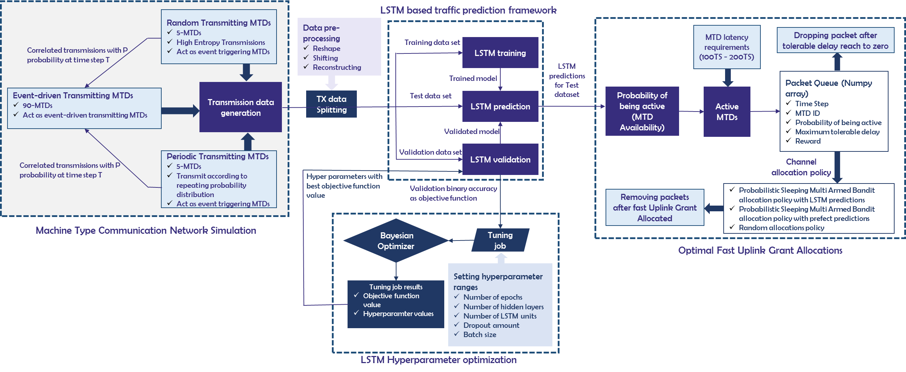

# Machine-Learning-Projects

## Blood Transfusion Service

The concept called **Gini importance** of variables and features in random forest classifiers can used to calculate the variable importance and then select most importance variables among other large number of variables or features in the random forest problem.

To explain the process an example dataset related to blood transfusion service centre has used as follow **[Dataset.csv].** To demonstrate the RFMTC marketing model (a modified version of RFM), this study adopted the donor database of blood transfusion service centre in Hsin-Chu city in Taiwan. The RFM ( **Recency, Frequency, Monetary** ) analysis is a marketing technique used to determine quantitatively which customers are the best ones by examining how recently a customer has purchased (recency), how often they purchase (frequency), and how much the customer spends (monetary). To build a FRMTC model, it has selected 748 donors from the donor database. These 748 donor data, each one included following variables,

1. **Recency** - months since last donation
2. **Frequency** - total number of donation
3. **Monetary** - total blood donated
4. **Time** - months since first donation
5. **Binary variable** - represent whether he/she donated blood in March 2007 ( **1** stand for donating blood; **0** stands for not donating blood)

A random forest classifier has used to build the RFMTC marketing model by considering above one to four variables as **independent variables** and fifth variable as **dependent variable** as in **ML Model.py** file.

## Fashion MNIST-SageMaker

Fashion-MNIST is a dataset of Zalando's article images—consisting of a training set of 60,000 examples and a test set of 10,000 examples. Each example is a 28x28 grayscale image, associated with a label from 10 classes. Zalando intends Fashion-MNIST to serve as a direct drop-in replacement for the original MNIST dataset for benchmarking machine learning algorithms. It shares the same image size and structure of training and testing splits.

The original MNIST dataset contains a lot of handwritten digits. Members of the AI/ML/Data Science community love this dataset and use it as a benchmark to validate their algorithms. In fact, MNIST is often the first dataset researchers try. "If it doesn't work on MNIST, it won't work at all", they said. "Well, if it does work on MNIST, it may still fail on others."

Zalando seeks to replace the original MNIST dataset
Content

Each image is 28 pixels in height and 28 pixels in width, for a total of 784 pixels in total. Each pixel has a single pixel-value associated with it, indicating the lightness or darkness of that pixel, with higher numbers meaning darker. This pixel-value is an integer between 0 and 255. The training and test data sets have 785 columns. The first column consists of the class labels (see above), and represents the article of clothing. The rest of the columns contain the pixel-values of the associated image.

## Google Stock Price Trend Prediction

## IOT Network Traffic Prediction

Machine type communication (MTC) will lead to remarkable and rapid developments in a wide range
of domains while evolving the nature of different environments and markets. It will connect a large
number of MTC devices to the internet and other networks, forming the ecosystem called the Internet
of Things. International telecommunication union (ITU) has defined, enabling massive MTC over
cellular networks as one of the key features of forthcoming 5G based international mobile
telecommunications (IMT) -2020 networks. MTC networks must be able to support ultra-reliable, low
latency communication and intelligently manage machine type devices (MTD) in real-time dynamic
environments. According to the existing literature, the concept of fast uplink grant shows potential to
realize above requirements and it is emerging as a promising solution for enabling massive machine
type communication (MTC) in the Internet of Things over cellular networks. The key intelligent features
of base station (BS) that are required for adapting the fast uplink grant, which are prediction of
Machine Type Devices which have data packets to transmit and the optimal allocation of the fast
uplink grant can be achieved by integrating notions of artificial intelligence (AI) and machine learning.
This project focuses on proposing an innovative learning framework for adapting to fast uplink grant
in cellular-enabled massive MTC using machine learning and deep learning concepts. 

## Proxy Climate Indicators

The World Data Center (WDC) for Paleoclimatology maintains the ice core data from polar and low-latitude mountain glaciers and ice caps throughout the world. Proxy climate indicators related to glaciers and ice caps include oxygen isotopes, methane concentrations, dust content, as well as many other parameters. As a one of important climate indicator correlation between CO2 level of ice core and age of the ice core, need to be investigate.

## Stock Market Anomaly Detection

#### part 1 :- Identifing outlier trades based on Executed Price & Executed Qty using Hierarchical Clustering¶

An outlier is a data point that differs significantly from other observations. Clustering is the task of dividing the population or data points into a number of groups such that data points in the same groups are more similar and data points in different groups are more differs. Therefore, when clusters form outlier data points will be cluster in to an outlier clusters.

#### part 2 :- Identifing outlier traders based on sum of Executed Qty using Hierarchical Clustering

Form above part 1 it’s possible to conclude that outlier trades form due to executed quantity of trades (the trade that enrol executed qty between 184 and 201) Therefore its possible to identify the outlier traders using hierarchical clustering based on the sum of executed qty for each buyer.

#### part 3 :- Identifing collusive trader group using Apriori Algorithm

Association rule learning is a rule-based machine learning method for discovering complex relationships between variables in large dataset. Apriori is an algorithm that use for frequent item set mining and association rule learning within databsets. It proceeds by identifying the frequent individual items in the database and extending them to larger and larger item sets as long as those item sets appear sufficiently often in the database.

Stock market manipulations as an organized collusive trader groups in stock market can be consider as one of major formats of market abuse, a Stock market manipulations can be extremely damaging to the proper functioning and integrity of capital markets.

Market manipulation refers to artificially inflating or deflating the price of a stocks or otherwise influencing the behavior of the market for personal gain. Two common types of stock manipulation are pump and dump and poop and scoop. The pump and dump is the most frequently used manipulation to inflate a microcap stock by artificially buying and then sell out, leaving later followers to hold the loss. Manipulation is variously called price manipulation, stock manipulation, and market manipulation. However, in this approach let’s focus more about price manipulation and run Apriori to identify frequent traders within the segments which shows considerable amount of stock price changes.
